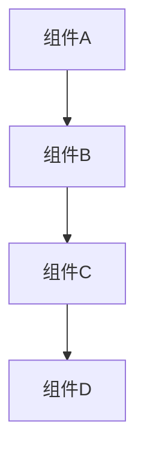
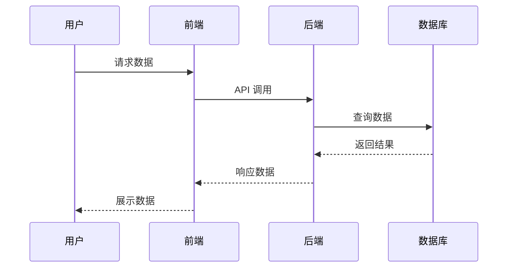
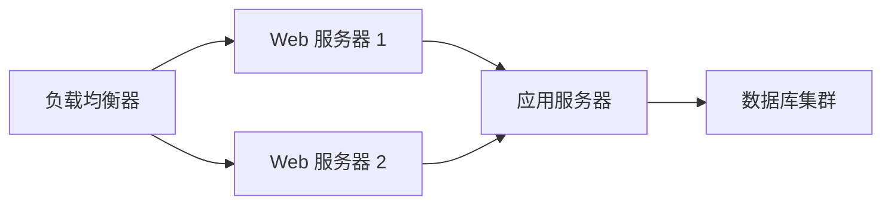

# [架构设计标题]

## 概述

[简要说明这个架构设计的背景、目标和核心价值]

## 设计目标

- 🎯 目标 1：[具体说明]
- 🎯 目标 2：[具体说明]
- 🎯 目标 3：[具体说明]

## 架构原则

1. **原则 1**：[说明]
2. **原则 2**：[说明]
3. **原则 3**：[说明]

## 系统架构

### 整体架构图

[对架构图的文字说明]

### 核心组件

#### 组件 1: [组件名称]

**职责：** [说明该组件的职责]

**技术栈：** [使用的技术]

**关键特性：**
- 特性 1
- 特性 2
- 特性 3

#### 组件 2: [组件名称]

**职责：** [说明该组件的职责]

**技术栈：** [使用的技术]

**关键特性：**
- 特性 1
- 特性 2

## 数据流

### 数据流图

### 关键流程说明

#### 流程 1: [流程名称]

1. 步骤 1：[说明]
2. 步骤 2：[说明]
3. 步骤 3：[说明]

## 技术选型

| 技术领域 | 选型 | 理由 |
|---------|------|------|
| 前端框架 | [技术] | [选择理由] |
| 后端框架 | [技术] | [选择理由] |
| 数据库 | [技术] | [选择理由] |
| 缓存 | [技术] | [选择理由] |

## 部署架构

### 部署拓扑

### 环境说明

- **开发环境：** [说明]
- **测试环境：** [说明]
- **生产环境：** [说明]

## 性能考虑

### 性能指标

| 指标 | 目标值 | 备注 |
|------|--------|------|
| 响应时间 | < 200ms | [说明] |
| 并发用户数 | > 10000 | [说明] |
| 可用性 | 99.9% | [说明] |

### 优化策略

1. **缓存策略：** [说明]
2. **数据库优化：** [说明]
3. **负载均衡：** [说明]

## 安全设计

### 安全措施

- 🔒 认证方式：[说明]
- 🔒 授权机制：[说明]
- 🔒 数据加密：[说明]
- 🔒 审计日志：[说明]

### 安全边界

[说明系统的安全边界和信任边界]

## 扩展性设计

### 水平扩展

[说明如何进行水平扩展]

### 垂直扩展

[说明如何进行垂直扩展]

## 监控与运维

### 监控指标

- 📊 系统指标：CPU、内存、磁盘、网络
- 📊 应用指标：请求量、响应时间、错误率
- 📊 业务指标：[自定义业务指标]

### 告警策略

[说明告警的触发条件和通知方式]

## 已知限制

1. **限制 1：** [说明]
2. **限制 2：** [说明]
3. **限制 3：** [说明]

## 未来规划

### 短期计划（1-3个月）

- [ ] 计划 1
- [ ] 计划 2

### 长期规划（6-12个月）

- [ ] 规划 1
- [ ] 规划 2

## 决策记录

### 决策 1: [决策标题]

- **日期：** YYYY-MM-DD
- **背景：** [决策背景]
- **决策：** [具体决策内容]
- **理由：** [决策理由]
- **影响：** [决策带来的影响]

### 决策 2: [决策标题]

[同上格式]

## 相关文档

- [相关设计文档](../相对路径/文档.md)
- [实施指南](../03-guides/...)

## 更新历史

| 版本 | 日期 | 更新内容 | 作者 |
|------|------|---------|------|
| 1.0.0 | YYYY-MM-DD | 初始版本 | [作者] |
