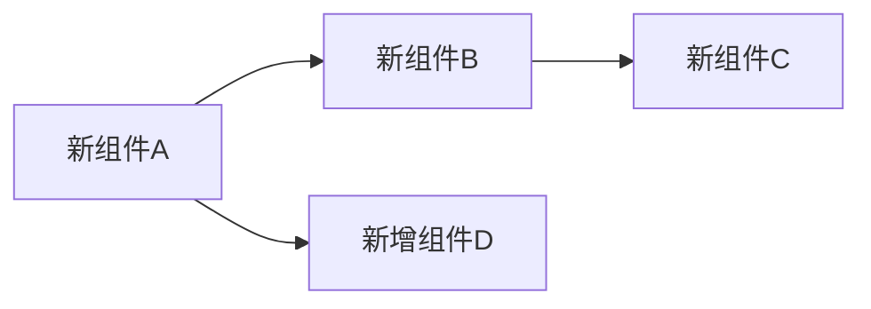

# [功能优化标题]

## 优化背景

### 当前问题

[描述当前存在的问题或限制]

### 优化动机

[说明为什么需要进行这次优化]

### 业务价值

- 💼 价值 1：[具体说明]
- 💼 价值 2：[具体说明]
- 💼 价值 3：[具体说明]

## 优化目标

### 性能指标

| 指标 | 优化前 | 优化后 | 提升 |
|------|--------|--------|------|
| 响应时间 | 500ms | 100ms | 80% ↓ |
| 内存使用 | 2GB | 1GB | 50% ↓ |
| CPU 使用率 | 80% | 40% | 50% ↓ |

### 功能目标

- 🎯 目标 1：[具体说明]
- 🎯 目标 2：[具体说明]
- 🎯 目标 3：[具体说明]

## 技术方案

### 方案概述

[整体技术方案的描述]

### 方案对比

| 方案 | 优点 | 缺点 | 评分 |
|------|------|------|------|
| 方案 A | [优点] | [缺点] | ⭐⭐⭐⭐ |
| 方案 B | [优点] | [缺点] | ⭐⭐⭐ |
| 方案 C（选择） | [优点] | [缺点] | ⭐⭐⭐⭐⭐ |

### 选择理由

[说明为什么选择当前方案]

## 实施方案

### 架构变更

#### 变更前


#### 变更后



### 代码变更

#### 关键代码片段

**变更前：**
```typescript
// 旧实现
function oldImplementation() {
  // 代码
}
```

**变更后：**
```typescript
// 新实现
function newImplementation() {
  // 优化后的代码
}
```

### 数据库变更

#### Schema 变更

```sql
-- 添加索引
CREATE INDEX idx_user_email ON users(email);

-- 添加字段
ALTER TABLE users ADD COLUMN last_login_at TIMESTAMP;
```

#### 数据迁移

[如果需要数据迁移，说明迁移策略]

```sql
-- 迁移脚本
UPDATE users SET status = 'active' WHERE status IS NULL;
```

## 实施步骤

### 第一阶段：准备工作

- [ ] 任务 1：[具体任务]
- [ ] 任务 2：[具体任务]
- [ ] 任务 3：[具体任务]

**预计时间：** [X 天]

### 第二阶段：核心实现

- [ ] 任务 1：[具体任务]
- [ ] 任务 2：[具体任务]
- [ ] 任务 3：[具体任务]

**预计时间：** [X 天]

### 第三阶段：测试验证

- [ ] 单元测试覆盖率 > 80%
- [ ] 集成测试通过
- [ ] 性能测试达标
- [ ] 压力测试通过

**预计时间：** [X 天]

### 第四阶段：上线发布

- [ ] 灰度发布（10% 流量）
- [ ] 监控指标正常
- [ ] 全量发布
- [ ] 旧代码清理

**预计时间：** [X 天]

## 风险评估

### 潜在风险

| 风险 | 影响 | 概率 | 缓解措施 |
|------|------|------|---------|
| 风险 1 | 高 | 中 | [缓解措施] |
| 风险 2 | 中 | 低 | [缓解措施] |
| 风险 3 | 低 | 高 | [缓解措施] |

### 回滚方案

如果出现严重问题，可以通过以下方式回滚：

1. 回滚步骤 1
2. 回滚步骤 2
3. 回滚步骤 3

**回滚时间：** 预计 [X 分钟]

## 测试计划

### 单元测试

```typescript
describe('新功能测试', () => {
  it('应该正确处理正常情况', () => {
    // 测试代码
  });

  it('应该正确处理异常情况', () => {
    // 测试代码
  });
});
```

### 性能测试

**测试场景：**
- 场景 1：[描述]
  - 并发用户：1000
  - 预期响应时间：< 100ms
  - 成功率：> 99.9%

- 场景 2：[描述]
  - 并发用户：5000
  - 预期响应时间：< 200ms
  - 成功率：> 99.5%

### 测试结果

| 测试类型 | 通过率 | 备注 |
|---------|--------|------|
| 单元测试 | 100% | [备注] |
| 集成测试 | 100% | [备注] |
| 性能测试 | 达标 | [备注] |

## 监控指标

### 关键指标

- 📊 **性能指标**
  - 响应时间 P50/P95/P99
  - QPS（每秒查询数）
  - 错误率

- 📊 **业务指标**
  - 功能使用率
  - 用户满意度
  - 转化率提升

### 告警设置

| 指标 | 阈值 | 告警级别 |
|------|------|---------|
| 响应时间 P99 | > 500ms | 警告 |
| 错误率 | > 1% | 严重 |
| CPU 使用率 | > 80% | 警告 |

## 优化成果

### 性能对比

[展示优化前后的性能对比数据、图表]

### 实际收益

- ✅ 收益 1：[具体数据]
- ✅ 收益 2：[具体数据]
- ✅ 收益 3：[具体数据]

## 经验总结

### 成功经验

1. 经验 1：[说明]
2. 经验 2：[说明]
3. 经验 3：[说明]

### 遇到的挑战

1. 挑战 1：[问题描述及解决方案]
2. 挑战 2：[问题描述及解决方案]

### 后续优化方向

- 🔮 方向 1：[说明]
- 🔮 方向 2：[说明]

## 相关文档

- [架构设计](../02-architecture/...)
- [部署指南](../03-guides/deployment/...)
- [监控运维](../04-operations/...)

## 更新历史

| 版本 | 日期 | 更新内容 | 作者 |
|------|------|---------|------|
| 1.0.0 | YYYY-MM-DD | 初始版本 | [作者] |
