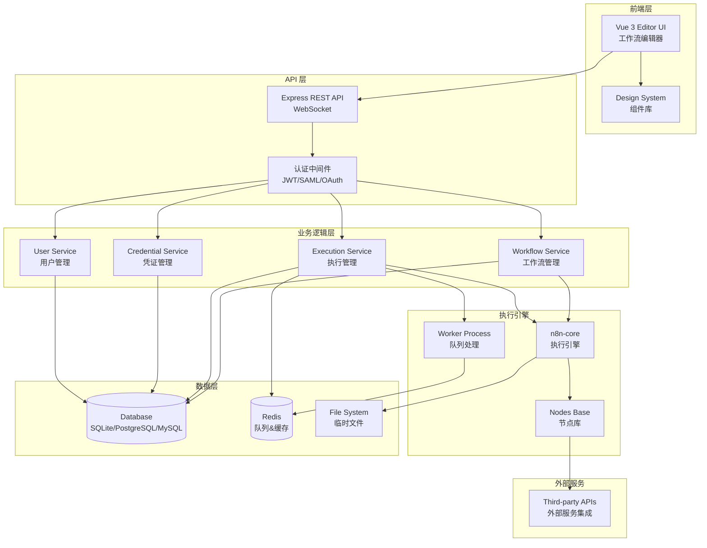
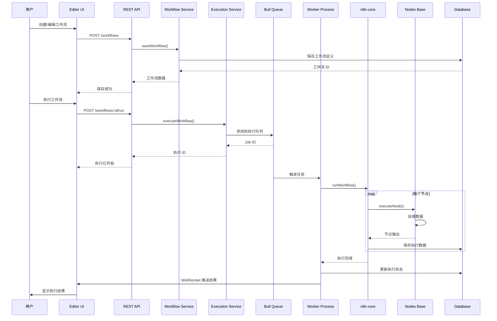
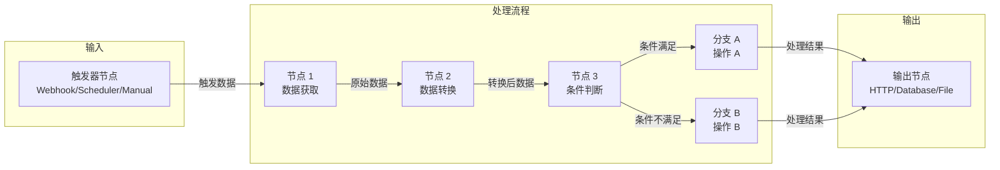
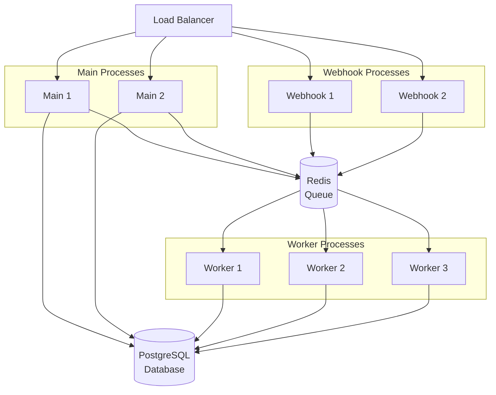

# n8n 项目核心架构

## 项目概述

n8n 是一个强大的工作流自动化平台，采用 TypeScript 编写，使用 Monorepo 架构组织代码。项目允许用户通过可视化界面创建、编辑和执行复杂的工作流，支持数百种第三方服务的集成。

**核心特性：**
- 基于节点的工作流编辑器
- 可扩展的节点系统
- 支持多种数据库（SQLite、PostgreSQL、MySQL）
- 分布式执行支持
- 企业级功能（权限管理、SSO、审计日志等）

## 技术栈

### 前端
- **框架**: Vue 3 + TypeScript
- **构建工具**: Vite
- **状态管理**: Pinia
- **UI 组件**: Element Plus + 自定义设计系统 (`@n8n/design-system`)
- **国际化**: Vue i18n (`@n8n/i18n`)
- **测试**: Vitest + Vue Test Utils

### 后端
- **运行时**: Node.js (>= 22.16)
- **框架**: Express.js
- **ORM**: TypeORM (`@n8n/typeorm`)
- **数据库**: SQLite / PostgreSQL / MySQL / MariaDB
- **消息队列**: Bull (基于 Redis)
- **依赖注入**: `@n8n/di`
- **测试**: Jest + Nock (服务器模拟)

### 开发工具
- **包管理**: pnpm (>= 10.22.0)
- **构建编排**: Turbo
- **代码检查**: ESLint + Biome
- **类型检查**: TypeScript 5.9
- **Git Hooks**: Lefthook

## Monorepo 结构

n8n 使用 pnpm workspaces 管理 Monorepo，项目代码组织如下：

```
packages/
├── @n8n/                    # n8n 组织的内部包
│   ├── api-types/          # 前后端共享的 TypeScript 接口
│   ├── config/             # 集中化配置管理
│   ├── db/                 # 数据库相关代码
│   ├── di/                 # 依赖注入容器
│   ├── errors/             # 错误类定义
│   ├── nodes-langchain/    # AI/LangChain 节点
│   ├── permissions/        # 权限管理
│   ├── task-runner/        # 任务运行器
│   ├── utils/              # 通用工具函数
│   └── ...
├── cli/                     # Express 服务器、REST API、CLI 命令
├── core/                    # 工作流执行引擎
├── workflow/                # 工作流基础类型和接口
├── editor-ui/               # Vue 3 前端应用
├── nodes-base/              # 内置节点集合
├── frontend/                # 前端相关包（设计系统、聊天等）
├── extensions/              # 扩展功能
└── testing/                 # 测试工具和 E2E 测试
```

## 核心包详解

### 1. `n8n-workflow` - 工作流基础层
**职责：** 定义工作流的核心数据结构、类型和接口
- 工作流、节点、连接的类型定义
- 数据处理和转换逻辑
- 表达式求值
- 无外部服务依赖，可独立使用

**关键依赖：**
- `lodash` - 数据操作
- `luxon` - 日期时间处理
- `jmespath` - JSON 查询
- `zod` - 数据验证

### 2. `n8n-core` - 执行引擎
**职责：** 工作流执行的核心逻辑
- 节点执行器
- 数据流管理
- HTTP 请求处理
- 文件操作
- SSH/SFTP 支持
- 凭证管理

**关键依赖：**
- `n8n-workflow` - 基础类型
- `axios` - HTTP 客户端
- `@aws-sdk/client-s3` - S3 存储
- `ssh2` - SSH 连接

### 3. `packages/cli` (n8n) - 主应用
**职责：** n8n 的主应用，提供 Web 服务和 CLI 工具
- Express REST API 服务器
- WebSocket 服务（实时通信）
- 数据库迁移和模型
- 用户认证（JWT、SAML、OAuth）
- 工作流调度
- Worker 进程管理
- 社区节点管理

**关键依赖：**
- `n8n-core` - 执行引擎
- `n8n-workflow` - 工作流类型
- `n8n-editor-ui` - 前端应用
- `n8n-nodes-base` - 内置节点
- `express` - Web 框架
- `bull` - 任务队列
- `@n8n/typeorm` - ORM
- `ioredis` - Redis 客户端

### 4. `packages/editor-ui` (n8n-editor-ui) - 前端应用
**职责：** 可视化工作流编辑器和管理界面
- 工作流画布编辑器
- 节点配置界面
- 执行历史查看
- 用户和权限管理界面
- 凭证管理界面

**关键依赖：**
- `vue` - 前端框架
- `pinia` - 状态管理
- `vue-router` - 路由
- `element-plus` - UI 组件库
- `@n8n/design-system` - 设计系统

### 5. `packages/nodes-base` - 内置节点库
**职责：** 提供数百个预构建的集成节点
- HTTP 请求节点
- 数据库节点（MySQL、PostgreSQL、MongoDB 等）
- 第三方服务节点（Slack、Google、AWS 等）
- 数据处理节点（过滤、聚合、转换）
- 触发器节点（Webhook、定时器、文件监听等）

### 6. `packages/@n8n/api-types` - API 类型定义
**职责：** 前后端共享的 TypeScript 接口
- REST API 请求/响应类型
- WebSocket 消息类型
- 确保前后端类型一致性

### 7. `packages/@n8n/db` - 数据库层
**职责：** 数据库连接和模型定义
- TypeORM 实体定义
- 数据库迁移
- 数据库配置

### 8. `packages/@n8n/config` - 配置管理
**职责：** 集中化的配置管理
- 环境变量处理
- 配置验证
- 默认值管理

## 架构模式

### 1. 依赖注入 (Dependency Injection)
使用 `@n8n/di` 包提供的 IoC 容器管理依赖关系，提高代码的可测试性和模块化。

```typescript
import { Service } from '@n8n/di';

@Service()
export class WorkflowService {
  constructor(
    private readonly workflowRepository: WorkflowRepository,
    private readonly executionService: ExecutionService,
  ) {}
}
```

### 2. Controller-Service-Repository 模式
后端遵循分层架构：
- **Controller**: 处理 HTTP 请求，参数验证
- **Service**: 业务逻辑层
- **Repository**: 数据访问层（TypeORM）

### 3. 事件驱动架构
使用内部事件总线实现模块间解耦通信：
- 工作流执行事件
- 用户操作事件
- 系统通知事件

### 4. 上下文执行 (Context-Based Execution)
不同类型的节点在不同的执行上下文中运行：
- **Main Context**: 标准节点执行
- **Task Runner Context**: 代码节点（沙箱环境）
- **Webhook Context**: Webhook 触发器

### 5. 前端状态管理
使用 Pinia Store 模式管理应用状态：
- `workflowsStore` - 工作流数据
- `nodeTypesStore` - 节点类型定义
- `uiStore` - UI 状态
- `credentialsStore` - 凭证管理

## 系统架构图

### 整体架构



### 工作流执行流程



### 数据流



## 核心概念

### 工作流 (Workflow)
工作流是节点的有向无环图 (DAG)，定义了数据的流转路径和处理逻辑。

**关键属性：**
- `nodes`: 节点列表
- `connections`: 节点间的连接
- `settings`: 工作流设置（错误处理、超时等）
- `staticData`: 静态数据存储

### 节点 (Node)
节点是工作流的基本执行单元，每个节点执行特定的任务。

**节点类型：**
- **Trigger Nodes**: 触发工作流执行（Webhook、定时器等）
- **Regular Nodes**: 标准处理节点
- **Action Nodes**: 执行操作（API 调用、数据库写入等）

**节点结构：**
- `type`: 节点类型标识
- `position`: 画布上的位置
- `parameters`: 节点配置参数
- `credentials`: 使用的凭证

### 连接 (Connection)
定义节点间的数据流向。

```typescript
{
  "source_node": [
    {
      "node": "target_node",
      "type": "main",
      "index": 0
    }
  ]
}
```

### 凭证 (Credentials)
安全存储第三方服务的认证信息。

**凭证类型：**
- API Key
- OAuth2
- Basic Auth
- Custom Authentication

### 执行 (Execution)
工作流的一次运行实例，记录执行的输入、输出和状态。

**执行状态：**
- `running`: 执行中
- `success`: 成功
- `error`: 失败
- `waiting`: 等待

## 扩展性

### 1. 自定义节点开发
开发者可以创建自定义节点：

```bash
pnpm create @n8n/node my-custom-node
```

### 2. 社区节点
支持安装社区开发的节点包：

```bash
n8n install @n8n_io/n8n-nodes-community-package
```

### 3. 自定义凭证类型
可以定义新的认证方式来支持特定服务。

### 4. 扩展 API
通过自定义 Express 中间件扩展 REST API。

## 部署架构

### 单实例部署
适合小规模使用：
- 单个 n8n 进程处理所有请求和执行

### 队列模式部署
适合高负载场景：
- **Main Process**: 处理 Web 请求
- **Worker Processes**: 执行工作流（可多实例）
- **Webhook Process**: 专门处理 Webhook 请求
- **Redis**: 作为队列和缓存



## 开发工作流

### 开发模式
```bash
# 启动完整开发环境（前端 + 后端）
pnpm dev

# 仅启动后端
pnpm dev:be

# 仅启动前端
pnpm dev:fe

# 开发 AI 相关功能
pnpm dev:ai
```

### 构建
```bash
# 构建所有包
pnpm build

# 类型检查
pnpm typecheck

# 代码检查
pnpm lint
```

### 测试
```bash
# 运行所有测试
pnpm test

# 运行单元测试
pnpm test:unit

# 运行集成测试
pnpm test:integration

# E2E 测试
pnpm --filter=n8n-playwright test:local
```

## 性能优化

### 1. 包分离
通过 Monorepo 结构实现按需加载和独立部署。

### 2. 代码分割
前端使用 Vite 的代码分割功能，按路由和组件动态加载。

### 3. 并发执行
工作流支持并行执行多个分支。

### 4. 缓存机制
- **Redis**: 缓存执行数据和会话
- **内存缓存**: 节点类型定义
- **HTTP 缓存**: 静态资源

### 5. 数据库优化
- 连接池管理
- 索引优化
- 查询优化

## 安全性

### 1. 认证
- JWT Token
- Session 管理
- OAuth 2.0
- SAML SSO（企业版）

### 2. 授权
- 基于角色的访问控制 (RBAC)
- 工作流级别权限
- 资源级别权限

### 3. 数据安全
- 凭证加密存储
- HTTPS 强制
- SQL 注入防护
- XSS 防护

### 4. 沙箱执行
代码节点在隔离的 Task Runner 中执行，防止恶意代码。

## 监控和日志

### 日志系统
使用 `winston` 进行结构化日志记录：
- 不同日志级别（error、warn、info、debug）
- 可配置的日志目标（文件、控制台、远程服务）

### 性能监控
- Prometheus 指标导出
- 执行时间跟踪
- 错误率统计

### 事件审计
记录关键操作：
- 用户登录
- 工作流创建/修改/删除
- 凭证访问
- 权限变更

## 参考资源

- [官方文档](https://docs.n8n.io/)
- [GitHub 仓库](https://github.com/n8n-io/n8n)
- [社区论坛](https://community.n8n.io/)
- [节点开发指南](https://docs.n8n.io/integrations/creating-nodes/)
