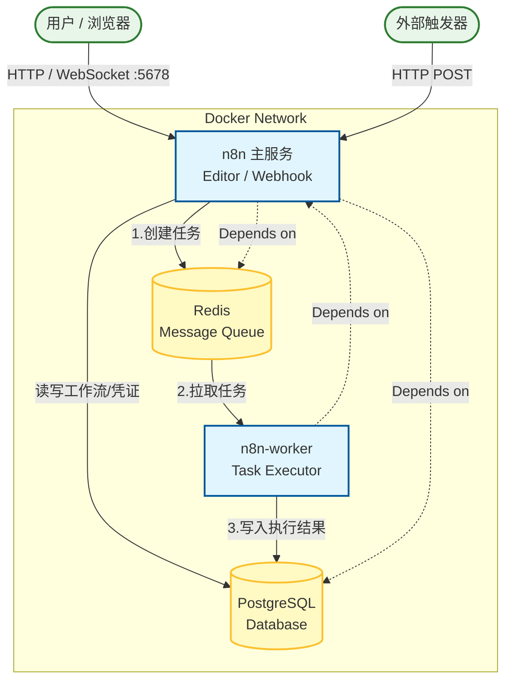

# 架构组件文档

## 1. 系统概览

本项目采用 **n8n Queue Mode (队列模式)** 部署架构。这种架构设计专为生产环境和高负载场景优化，将工作流的“编辑/管理”与“实际执行”分离，实现了更好的稳定性和水平扩展能力。

## 2. 核心组件模块

### 🛠️ n8n (Main Component)
- **服务名称**: `n8n`
- **核心角色**: 系统的主要控制台和入口。
- **主要职责**:
  - **用户界面**: 提供 Web 编辑器 (默认端口 5678)，供用户设计和管理工作流。
  - **API 服务**: 处理外部 API 请求和 Webhook 调用。
  - **任务调度**: 接收触发器信号，将工作流执行任务封装后推送到 Redis 队列中，而不是在本地直接执行（除了手动测试运行时）。
- **依赖关系**: 依赖 PostgreSQL 存储数据，依赖 Redis 发送任务。

### 👷 n8n-worker (Execution Component)
- **服务名称**: `n8n-worker`
- **核心角色**: 幕后的劳模，专注于任务执行。
- **主要职责**:
  - **任务处理**: 持续监听 Redis 队列，抢占并获取待执行的工作流任务。
  - **隔离运行**: 在独立的进程/容器中运行工作流，防止单任务高资源消耗影响主编辑器及其它任务。
  - **结果上报**: 执行完成后，将状态和结果数据回写到 PostgreSQL 数据库。
- **扩展性**: 可以简单地通过部署更多 Worker 容器来提升并发处理能力。

### 🗄️ PostgreSQL (Database)
- **服务名称**: `postgres` (版本: 16)
- **核心角色**: 系统的持久化记忆中心。
- **主要职责**:
  - **存储定义**: 保存所有的工作流 (Workflows) JSON 结构。
  - **存储凭证**: 安全加密存储用户配置的各类 API Key 和密码 (Credentials)。
  - **存储历史**: 记录每一次工作流执行的详细日志和数据 (Executions)。

### 📨 Redis (Message Broker)
- **服务名称**: `redis` (版本: 6-alpine)
- **核心角色**: 服务间的高速通信枢纽。
- **主要职责**:
  - **消息队列**: 缓存待执行的任务 (`Jobs`)。
  - **发布/订阅**: 协调主服务和 Worker 之间的状态更新。
  - **通信缓冲**: 解耦 Web 请求和重型计算任务，确保高并发下的系统响应速度。

## 3. 模块架构图

以下 Mermaid 图表展示了各组件之间的数据流向与依赖关系：

## 4. 数据持久化 (Volumes)

为了保证数据不丢失，系统配置了以下 Docker Volumes：

| Volume 名称 | 挂载路径 | 用途 |
| :--- | :--- | :--- |
| **db_storage** | `/var/lib/postgresql/data` | PostgreSQL 数据库文件，包含所有业务核心数据。 |
| **n8n_storage** | `/home/node/.n8n` | n8n 的配置文件、加密密钥文件 (Encryption Key) 等。 |
| **redis_storage** | `/data` | Redis 的持久化数据（RDB/AOF），防止重启后队列丢失。 |
